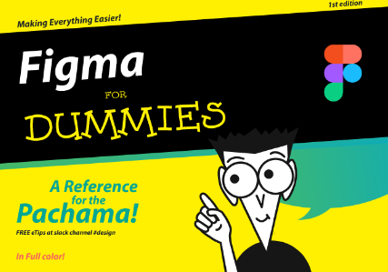

# Figma Fundamentals: A Quick Reference Guide
This collection of figma tools is designed to serve as quick reference guide for users to get a brief discription of the tool and its capabilities. Select a tool below to learn more about it.
<!-- Place quick introduction here -->

|   |   |   |   |
| :---: | :----: | :----: | :----: |
|    [**Shape Tools**](#) |    [**Pen Tools**](#) |    [**Auto Layout**](#) |    [**Constraints**](#) |
|    [**Gradients**](#) |    [**Effects**](#) |    [**Color Picker**](#) |    [**Creating Styles**](#) |
|    [**Rounded Corners**](#) |    [**Text Tools and Fonts**](#) |    [**Boolean Operations**](#) |    [**Images**](#) |
|    [**Alignment and Distribution**](#) |    [**Layout Grids**](#) |    [**Guides**](#) |    [**Easing Curves**](#) |
|    [**Variants**](#) |    [**Interactive Components**](#) |    [**Masks**](#) |    [**Branching and Merging**](#) |
|    [**Image Discription**](#) |    [**Image Discription**](#) |    [**Image Discription**](#) |    [**Image Discription**](#) |

|			Image				|		Title			|				Discription				          |
| :---------------------------------------------------: | :------------------------------------ | :------------------------------------------------------------------------------ |
| 	| [Figma User Interface]()    | Explaining the layout and user interface of figma. |
| 	| [Different components]()    | This is what i entend the discrip tion to be.  nothing more than this really |
| 	| [Shape Tools]()    | This is what i entend the discrip tion to be.  nothing more than this really |
| 	| [Pen Tools]()    | This is what i entend the discrip tion to be.  nothing more than this really |
| 	| [Auto Layout]()   | This is what i entend the discrip tion to be.  nothing more than this really |
| 	| [Constraints]()    | This is what i entend the discrip tion to be.  nothing more than this really |
| 	| [Gradients]()    | This is what i entend the discrip tion to be.  nothing more than this really |
| 	| [Effects]()    | This is what i entend the discrip tion to be.  nothing more than this really |
| 	| [Colour Picker]()    | This is what i entend the discrip tion to be.  nothing more than this really |
| 	| [Creating Styles]()    | This is what i entend the discrip tion to be.  nothing more than this really |
| 	| [Rounded Corners]()    | This is what i entend the discrip tion to be.  nothing more than this really |
| 	| [Text Tools and Fonts]()    | This is what i entend the discrip tion to be.  nothing more than this really |
| 	| [Boolean Operations]()    | This is what i entend the discrip tion to be.  nothing more than this really |
| 	| [Images]()    | This is what i entend the discrip tion to be.  nothing more than this really |
| 	| [Alignment and Distribution]()    | This is what i entend the discrip tion to be.  nothing more than this really |
| 	| [Layout and Grids]()    | This is what i entend the discrip tion to be.  nothing more than this really |
| 	| [Guides]()    | This is what i entend the discrip tion to be.  nothing more than this really |
| 	| [Erasing Curves]()    | This is what i entend the discrip tion to be.  nothing more than this really |
| 	| [Varients]()    | This is what i entend the discrip tion to be.  nothing more than this really |
| 	| [Interactive Components]()    | This is what i entend the discrip tion to be.  nothing more than this really |
| 	| [Masks]()    | This is what i entend the discrip tion to be.  nothing more than this really |
| 	| [Branching & Merging]()    | This is what i entend the discrip tion to be.  nothing more than this really |

