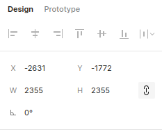
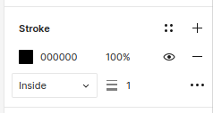

###### [Home](../index.md){: style="width:50%"} | [Back](../fundamentals/index.md){: style="width:50%"}

# **Basic Shape Tools**:
Basic shapes are the building blocks of every infetfeace. Shapes like circles or rectangles make can make up everything form avatars and to buttons. Within figma the shape tools are a collection of six tools that create those basic shapes. The deafult tool is the shape tool in the toolbar is the rectagle tool. By clicking the dropdown arrow next to it we can find the rest of the shape tools. 

### Vector Shapes
When using the shape tools, they create `vector shapes`. A vector shape is made up of `vector points`, and connected through mathmatical curves or lines called `paths`. Vecor shapes can be scaled [`lossless`](https://en.wikipedia.org/wiki/Vector_graphics) to any size. What this means is unlike convential [`rater images`](https://en.wikipedia.org/wiki/Raster_graphics) which pixelate when scaled larger, `vecotor shapes` will always look the same at any scale.

### Creating Shapes
Addidtional functionality is availbile when creating shapes. By pressing one or a combination of the button will cause the shape to adjust in certain ways. Select the elipse tool or press `o` on your keyboard.

**Holding down button/s while creating/resizing**:
- `Shift`: Create/resise shape with perfect semmetry
- `alt`: Create/resise from the shapes centre point.
- `alt` + `shift`: Create/resise shapes with perfect semmetry from the shapes center point.

### Selecting Shapes
By selecting the shape various options become availible. To select a shape simply click on it.

#### Properties
When selecting a shape it displayes its properties in the right side pannel. From here the shapes `x` and `y` position can be seen, along with it's `heigh` and `width`, `angle` and `corner radius`.

**Fill**: By defult all shapes are grey in colour. To change the color click on the swatch to open the color picker. Fromhere yoou can adjust the color to whatever you want. When your happy click on the `X` to close the color picker.

**Stroke**: This is the outline of the shape. Some more properties like color line thinkness and outline alignment can be adjusted. Clicking the `...` you can access advanced stroke options.

### Advanced shape options
By double clicking on the shape you can access advanced shape options. These options allow you to manipulate vecotr points which makes up the shape, giving you the ability to create irregular shapes.

