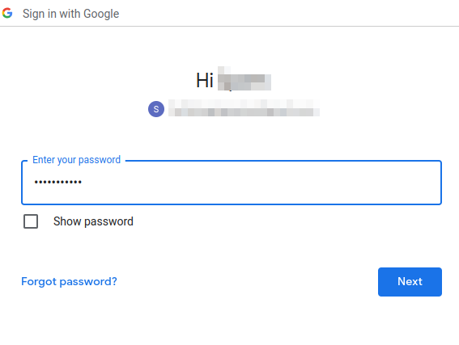
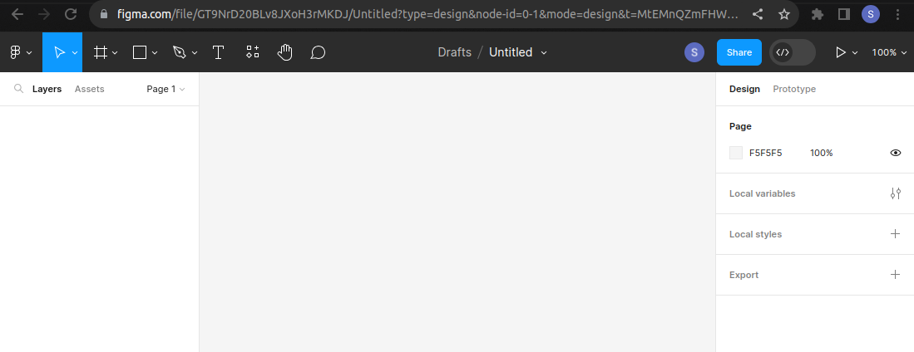
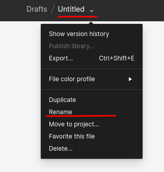

# Create a Figma Account

Although we can use figma we will need to register an account to be able to save the work we do. Dont worry creating an new figma account if **Free**. 

1. Navigate to `http://www.figma.com`
2. Click on `Get started for free`

3. Create alogin or login with your google account. Personally i prefer to login with my google account

4. Select your google account from the list.

5. Login to your google account.

Once you have loged in to your google account a `Tel us about yourself` page will be displayed. Most of the steps here can be skipped. For the ones which cant be skipped select the most relevant answers. 

> **:heavy_exclamation_mark:Note:** *A Prompt to select a plan will be displayed. You can select try for free frim the list of plans.*

After completing the questionair the figma main page will be displayed. Congratulations! you have successfully created a `free` Figma account.

# Create New figma project

Once a `free` figma account has been created, we can start the design process. 

Figma allows users to have 5 free project boards. This means you can create 5 projects with figma without having to pay a cent. If you run out of priject boards you can simply delete one o your priject boards to reclaim a free project board. 

> **:heavy_exclamation_mark:Note:** *Figma is a free to use platform. You should never have to pay a single :heavy_dollar_sign: to use it, unless you would like to unlock premium features. Premium features include unlimited priject boards.*

To create a new project board simply select `+ Design file` from the top right corner. 

This will load a blank figma design file for you to create designs in. 

If you wish to give your project a name, you can easily do so by selecting the dropdown arrow netx to Untitled and selecting renam frorm the list. Well rename and create a project in the next page of this tutorial.

Figma automatically saves your work as you work, so dont worry about losing everything if you lose connectivity. Figma auto sync any changes to the board seamlessly allowing collaborators to seamlessly work togeter on the same project. 

> **:heavy_exclamation_mark:Note:** *Figma will continuously sync for as long as you have an active internet connectin. If your internet connection is lost, you will still be able to continue working, however your design file can no longer sync. This means if you exist the figma page whilst your internet connection is lost, you risk losing all recent changes to the file.*

The next time you navigate to figma's web page your project will be displayed in the recently viewed pages. 

